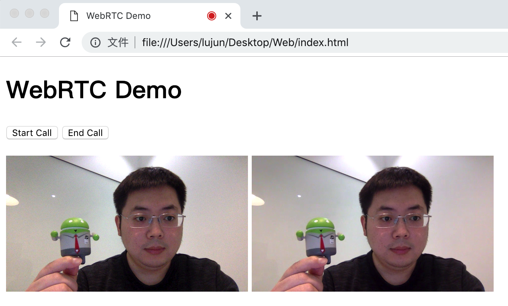

# RTCStartupDemo

A startup demo for [webrtc](https://webrtc.org/) beginners, Including a simple signal server base on [socket.io](https://socket.io) , and some client demos on Web/Android/iOS/Windows Platform.

## 1. What is included ?

- [x] [RTCSignalServer ](RTCSignalServer)
    - [x] A simple signal server written in Golang. Support simple room management and message exchange.
    - [x] API Reference:  [api.md](RTCSignalServer/README.md)

- [x] [RTCClientDemo](RTCClientDemo)
  - [x] Web
  - [x] Android
  - [ ] iOS（coming soon）
  - [ ] Windows（coming soon）

### 2. Overview

### 2. Usage

The demos only support 2 peers making call in the LAN. The peer can come from different platform.

You can't make call without a signal server. The RTCSignalServer can be built and host by yourself which is recommend. 

### 3. Dependence

- [x] [webrtc](https://webrtc.org/)
- [x] [socket.io](https://socket.io)

### 4. Links
[webrtc-codelabs](https://codelabs.developers.google.com/codelabs/webrtc-web)

### 5. Contact

Email：[lujun.hust@gmail.com](mailto:lujun.hust@gmail.com)
